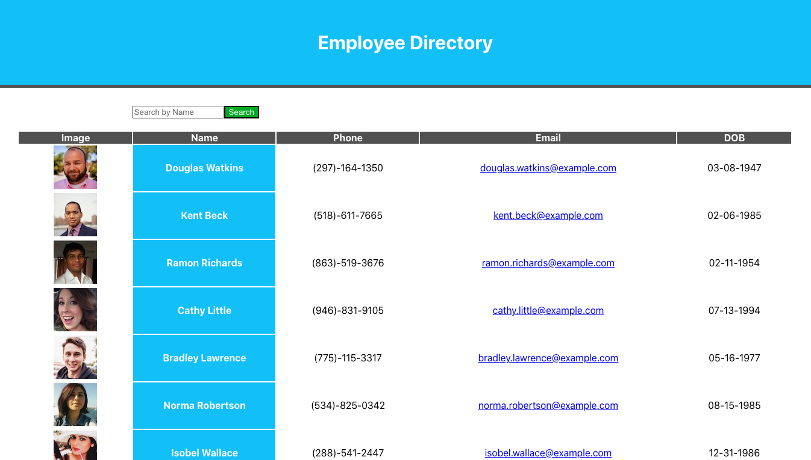

# Employee Directory

This project was bootstrapped with [Create React App](https://github.com/facebook/create-react-app).

## Description

An employee directory react application that loads a table filled with non-sensitive data on employees. This app uses data from the Random User Generator API to view the image, name, phone number, email, and DOB of several employees. You can search an employee by their first name with the search bar and also order them by name from A-Z by clicking on the "Name" column.

## Table of Contents

* [Installation](#Installation)
* [Usage](#Usage)
* [Questions](#Questions)
* [License](#License)

## Installation

Run 'npm install' to download the packages: express, axios, react, react-dom and react-scripts.

## Usage

Run 'npm start' after downloading and opening this repository folder,

or use the deployed link: <https://andrewyen64.github.io/employee-directory/>

## Questions

* Github: <https://github.com/andrewyen64>

* Email: andrewyen64@gmail.com

## License

GNU_v3.0 License

Copyright © 2020 Andrew Yen

[Link to License](LICENSE)
